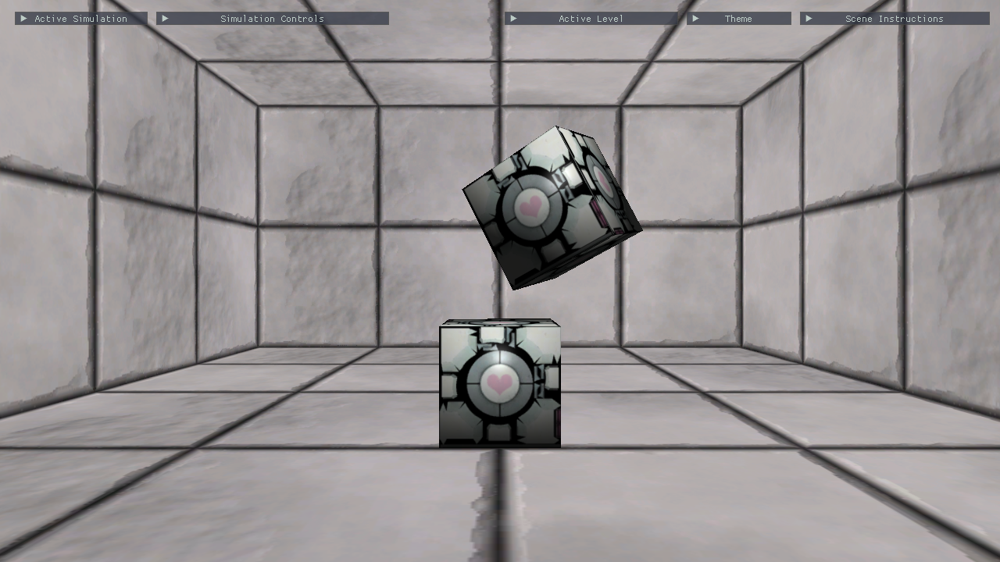

# Physics Framework

A physics framework created using DirectX 11 which implements numerous simulations: a mass aggregate system, particle generation and rigid body rotations.

*- Click image to view on YouTube -*

## List of Features

- [x] Mass Aggregate system
- [x] Component System
- [x] Particle Generation
- [x] Broad/Narrow Phase Collisions
- [x] Rigid Body Collision Resolution
- [x] Rigid Body Rotations
- [x] Parameter Control System

---

### Credits
        
        Code Reference:
                    Millington, I 2010, Game Physics Engine Development: How to Build a Robust Commercial-Grade Physics Engine for Your Game, 2nd Edition, CRC Press, Florida [ISBN-13: 978-0123819765]
		    
	    Design Reference:
                    Nystrom, R 2014, Game Programming Patterns, 1st Edition, Genever Benning, Canada [ISBN-13: 978-0990582908]
